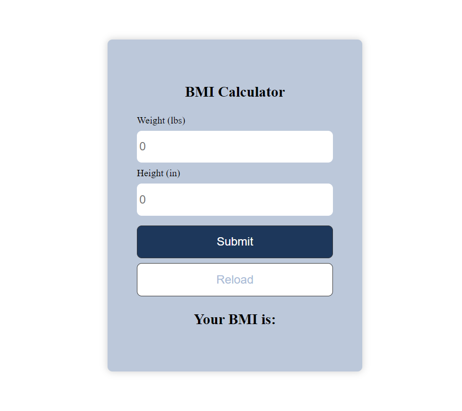

# BMI Calculator

## Description
The BMI Calculator is a web application built using ReactJS and useState hooks. It allows users to calculate their Body Mass Index (BMI) based on their weight and height inputs.

## Features
- Calculate BMI instantly
- Simple and intuitive user interface
- ReactJS with useState hooks for state management

## Live Demo
Try out the live BMI Calculator [here] https://bmi-calculator-iims.vercel.app .

## Screenshots

## Installation
1. Clone the repository: `git clone https://github.com/yourusername/bmi-calculator.git`
2. Navigate to the project directory: `cd bmi-calculator`
3. Install dependencies: `npm install`
4. Start the development server: `npm start`

## Contributing
Contributions are welcome! If you have ideas for new features or improvements, please open an issue or submit a pull request.

## License
This project is licensed under the MIT License - see the [LICENSE](LICENSE) file for details.
